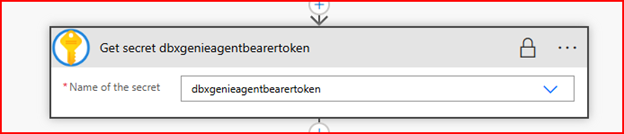

# F1 Racing Agent Genie Databricks Installation Guide

## Overview

With the advent of Agents for Everything, Microsoft has enabled a generative AI experience for Databricks for Azure named Genie. Following a multi-agent architecture, low-code Agent creators can extract meaningful data from Databricks with a simple Power Automate Flow and HTTP Connector.

The Racing Agent is an Agent created with Copilot Studio and published to Microsoft Teams. It uses the Conversational Boosting Topic that calls an Agent Flow. This Flow uses an HTTP Connector to call the Genie API. The Genie API will interpret the Utterance from the caller, construct the appropriate query, and return the results in a structured JSON string. The string will be parsed in the Copilot Agent leveraging an AI Prompt and then reflected back to the user in Microsoft Teams.

## Prepare for Installation

1. If you don’t have a working Databricks repository in Azure, create one.
2. Import the Azure Databricks Formula 1 Racing Data Engineering solution as per this GitHub repo:  
   [https://github.com/shubham14yadav/Azure-Databricks-Formula-1-Racing-Data-Engineering](https://github.com/shubham14yadav/Azure-Databricks-Formula-1-Racing-Data-Engineering)
3. Configure the Genie Conversation API per this article: [Set up and manage an AI/BI Genie space | Databricks Documentation](https://docs.databricks.com/aws/en/genie/set-up)

> Note the following items from the Genie API setup as they’ll be required for the installation of the Microsoft Copilot Studio solution:
> - Genie base URL
> - Genie Space Id

4. Create an Azure Key Vault with the Bearer token from the step on configuring the Genie Conversation API:
   - Make sure you are logged on as the user under which the solution will be installed and the Agent Flow will run.
   - Name the Key Vault: `dbxgenieagent`.
   - Add the role **Key Vault Admin** to your user.
   - Create a secret: `dbxgenieagentbearertoken`.
   - Set the value of the secret to the Bearer token.
   - Save your changes.

5. Import the solution into a Power Platform Environment:
   - Import the unmanaged solution from the latest [release](https://github.com/v7herman4/Copilot-and-Genie/releases) folder: `F1RacingAgentGenieDatabricks_N_N_N_N.zip`.
   - Ensure all connection references are validated and created.
   - Set the Environment Variables from the Genie API.
   - Publish All Customizations.
   - Open the Agent in Copilot Studio.
   - Publish the Agent.

## Configure the Solution

You must update the Agent Flow to ensure the bearer token is being retrieved from the correct Azure Key Vault.

1. Open the Agent Flow “Ask Databricks Genie”.
2. On the step labeled “Get secret dbxgenieagentbearertoken”:
   - Validate/create the connection.
   - Validate/select the correct Azure Key Vault.
   - Validate/select the correct secret.

3. Save and publish the Agent Flow.

## Collaborators

Many people contributed to this solution! A big thanks to the team for their efforts.

- Melissa Lacefield / [@melilace](https://github.com/melilace)
- Josh Hays
- Johnny Harbieh
- Valter Herman / [@v7herman4](https://github.com/v7herman4)
